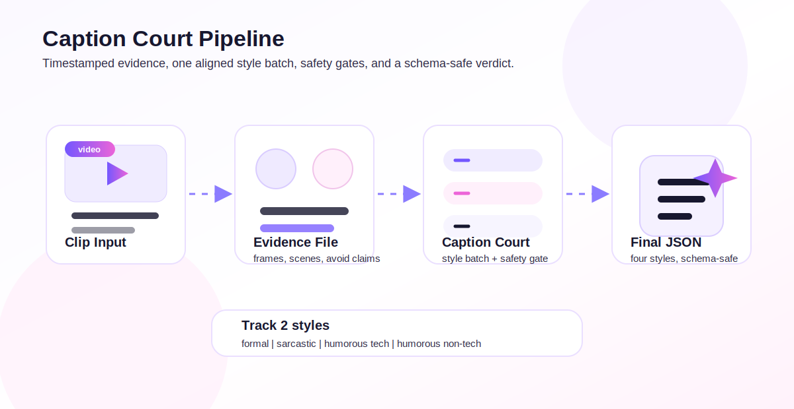
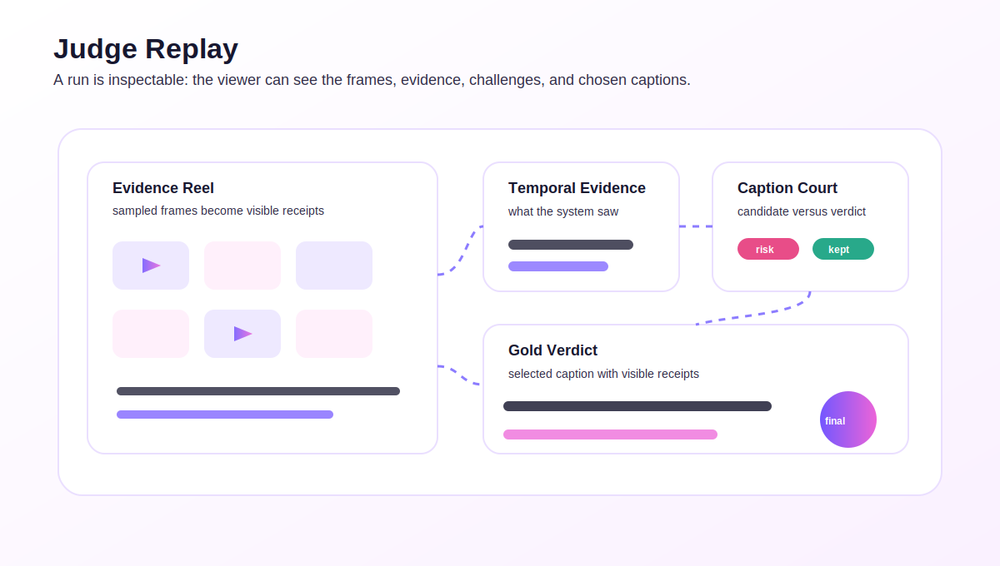
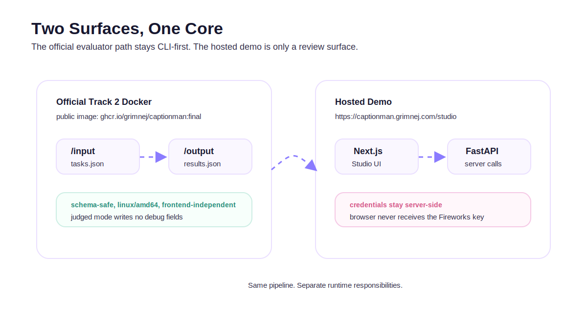
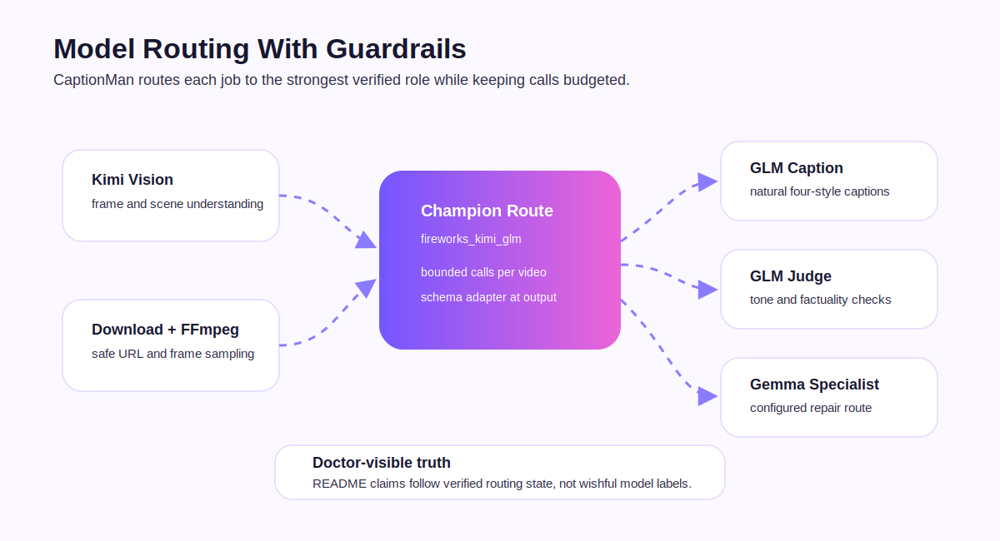

<p align="center">
  
</p>

<p align="center">
  
</p>

<h1 align="center">CaptionMan</h1>

<p align="center">
  <strong>Captions With Receipts</strong>
</p>

<p align="center">
  Evidence-first video captioning for AMD Developer Hackathon ACT II Track 2.
</p>

<p align="center">
  <a href="https://captionman.grimnej.com/studio"></a>
  <a href="https://github.com/GrimNej/CaptionMan"></a>
  
  
</p>

<p align="center">
  
  
  
  
  
</p>

---

## What Is CaptionMan?

CaptionMan is a professional video-captioning system built for **Track 2: Video Captioning**. It takes a video clip and produces the four required caption styles:

- `formal`
- `sarcastic`
- `humorous_tech`
- `humorous_non_tech`

The core idea is simple: CaptionMan does not trust the first model response. It samples the video, builds an evidence file, generates caption candidates, challenges unsupported claims, repairs weak outputs, and exports schema-safe Track 2 results.

That is the project moat: **Caption Court**.

---

## Live Submission Links

| Item | Link |
|---|---|
| Hosted demo | <https://captionman.grimnej.com/studio> |
| Public repository | <https://github.com/GrimNej/CaptionMan> |
| Docker image | `docker.io/grimnej/captionman:submission` |
| Pinned digest | `docker.io/grimnej/captionman@sha256:b0626dc06303c3b711b0e29711b2b485eac6b84b5daef84dd10ebd12af99af2c` |

The Docker image is the official judged artifact. The hosted demo is a review surface for humans.

---

## The Caption Court Pipeline



CaptionMan turns video captioning into an evidence-backed workflow:

| Stage | What Happens |
|---|---|
| Clip Input | Download or read the video, inspect duration, and sample representative frames. |
| Evidence File | Build grounded observations, frame references, avoid-claims, and scene summaries. |
| Caption Court | Generate and challenge candidates for factuality, tone, coverage, and risk. |
| Final JSON | Export only the official Track 2 caption schema, without debug leakage. |

Official output shape:

```json
[
  {
    "task_id": "v1",
    "captions": {
      "formal": "...",
      "sarcastic": "...",
      "humorous_tech": "...",
      "humorous_non_tech": "..."
    }
  }
]
```

---

## Judge Replay



The hosted Studio includes a Judge Replay page for completed runs. It shows:

- sampled frames as visual receipts
- temporal evidence segments
- caption candidates and selected captions
- repair/verdict details
- final captions ready for copy or review

This is intentionally separate from the official Docker output. Judges get a clean JSON file from Docker; humans get an explainable product experience in the demo.

---

## Official Docker Path



The judged Docker path is backend-only and does not depend on the frontend.

```bash
docker pull --platform linux/amd64 docker.io/grimnej/captionman:submission
docker run --rm docker.io/grimnej/captionman:submission captionman doctor
```

For official evaluation, mount input and output folders:

```bash
docker run --rm \
  -v "$PWD/input:/input" \
  -v "$PWD/output:/output" \
  docker.io/grimnej/captionman:submission
```

Then validate the output:

```bash
python scripts/validate_results.py --input input/tasks.json --output output/results.json
```

The final public image was verified as:

- publicly pullable
- `linux/amd64`
- official-mode safe
- schema-valid on the Track 2 practice clips
- no debug fields in judged output
- no repository secrets detected before push

---

## Model Routing



CaptionMan uses role-based routing rather than pretending one model should do everything.

| Role | Verified Route |
|---|---|
| Visual understanding | Kimi route through Fireworks |
| Caption writing | GLM route through Fireworks |
| Judge/repair checks | GLM route through Fireworks |
| Gemma | Configured specialist route; claimed only to the level reported by `captionman doctor` |

Current public claim: **Gemma is configured as a routed specialist/repair option, but the verified champion route for the final Docker image is Kimi + GLM.**

This wording is deliberate. CaptionMan does not claim Gemma-only caption generation or Gemma multimodal behavior unless the doctor output and tournament notes verify that route.

---

## Hosted Demo

The hosted demo is live at:

```text
https://captionman.grimnej.com/studio
```

The demo supports:

- direct video URLs
- local video uploads
- queued runs
- four-style caption output
- real sampled-frame replay
- Judge Verdict pages
- run history
- server-side Fireworks credentials

The browser never receives the Fireworks API key. Runtime credentials live only on the server.

---

## Quick Start: Mock Provider

Use mock mode for local development without spending provider credits.

```bash
cd apps/api
uv sync
uv run captionman demo-fixture --output ../../input/tasks.json
AI_PROVIDER=mock uv run captionman run --input ../../input/tasks.json --output ../../output/results.json
cd ../..
python scripts/validate_results.py --input input/tasks.json --output output/results.json
```

---

## Quick Start: Fireworks Provider

Create a local `.env` from the example:

```bash
cp .env.example .env
```

Set at least:

```text
FIREWORKS_API_KEY=...
AI_PROVIDER=fireworks_direct
MODEL_ROUTING_MODE=champion
CHAMPION_ROUTE=fireworks_kimi_glm
GEMMA_MODEL=accounts/fireworks/models/gemma-4-31b-it
GEMMA_USAGE_MODE=off
REQUIRE_GEMMA_FOR_SUBMISSION=false
```

Then verify provider readiness:

```bash
cd apps/api
uv run captionman doctor
```

Real provider runs can spend Fireworks credits. Use mock mode for routine checks.

---

## Local Demo

On Windows:

```powershell
powershell -NoProfile -ExecutionPolicy Bypass -File scripts\launch_demo.ps1 -Restart
```

The launcher starts:

- FastAPI API on port `8000`
- production Next.js Studio on port `3000`
- health checks for `/api/health`
- doctor checks for `/api/doctor`
- the Studio route at `/studio`

---

## Project Structure

```text
CaptionMan/
|-- assets/                  # README branding: banner and logo
|-- SVGs/                    # Animated README diagrams
|-- apps/
|   |-- api/                 # CLI runner, FastAPI demo API, providers, tests
|   `-- web/                 # Next.js Studio and Judge Replay UI
|-- deploy/
|   `-- vps/                 # Non-secret hosted-demo deployment templates
|-- docs/                    # Living implementation, test, and submission docs
|-- input/                   # Local judged-run input mount
|-- output/                  # Local judged-run output mount
|-- prompts/                 # Model-facing prompt files and guardrails
|-- scripts/                 # Validators, hygiene checks, launcher
|-- Dockerfile               # Official judged runner image
|-- Dockerfile.demo          # Demo packaging path
`-- README.md
```

---

## Verification Commands

Backend:

```bash
cd apps/api
uv run pytest
```

Web:

```bash
pnpm --filter web test
pnpm --filter web build
```

Repository hygiene:

```bash
python scripts/check_source_hygiene.py
python scripts/check_no_secrets.py
```

Docker smoke test:

```bash
docker run --rm docker.io/grimnej/captionman:submission captionman doctor
```

---

## Security And Credential Handling

CaptionMan follows a strict credential boundary:

- `.env` is never committed.
- Fireworks keys are not printed in logs.
- Browser code never receives provider keys.
- Official output does not contain debug artifacts.
- The final embedded-key image uses a temporary hackathon-only key.
- That key must be revoked or rotated after judging.

The hosted VPS demo reads credentials from server-side environment files. The repository contains only non-secret deployment templates.

---

## Why CaptionMan Is Different

Most caption demos stop at "upload video, ask model, show text."

CaptionMan adds the missing production layer:

- evidence before captions
- challenge before verdict
- repair before export
- schema lock before output
- budget controls before provider calls
- Docker isolation before judging
- human-readable replay without polluting official JSON

The result is a system built for both evaluation and inspection: clean enough for the official runner, clear enough for a judge to understand, and strict enough to avoid obvious captioning failures.

---

## Documentation

| Document | Purpose |
|---|---|
| [`docs/SUBMISSION_CHECKLIST.md`](docs/SUBMISSION_CHECKLIST.md) | Final image and submission gates |
| [`docs/TEST_REPORT.md`](docs/TEST_REPORT.md) | Verification history |
| [`docs/SPEC_LOCK.md`](docs/SPEC_LOCK.md) | Track 2 schema and adapter notes |
| [`docs/CREDENTIAL_STRATEGY.md`](docs/CREDENTIAL_STRATEGY.md) | Direct/provider/proxy credential strategy |
| [`docs/GEMMA_PROOF.md`](docs/GEMMA_PROOF.md) | Gemma claim boundary |
| [`deploy/vps/README.md`](deploy/vps/README.md) | Hosted demo deployment notes |

---

## License

MIT. See [`LICENSE`](LICENSE).

---

<p align="center">
  <strong>CaptionMan</strong><br />
  Captions With Receipts.
</p>
